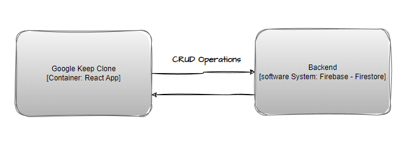

# Wiki

This app is a React client, which uses Firestore database for data storing.

## General architecture



## Project Structure

```bash
.
├── public = Public files
├── src = App code
│   └── components
└── wiki = Project documentation
    ├── img
    └── rsc
```
